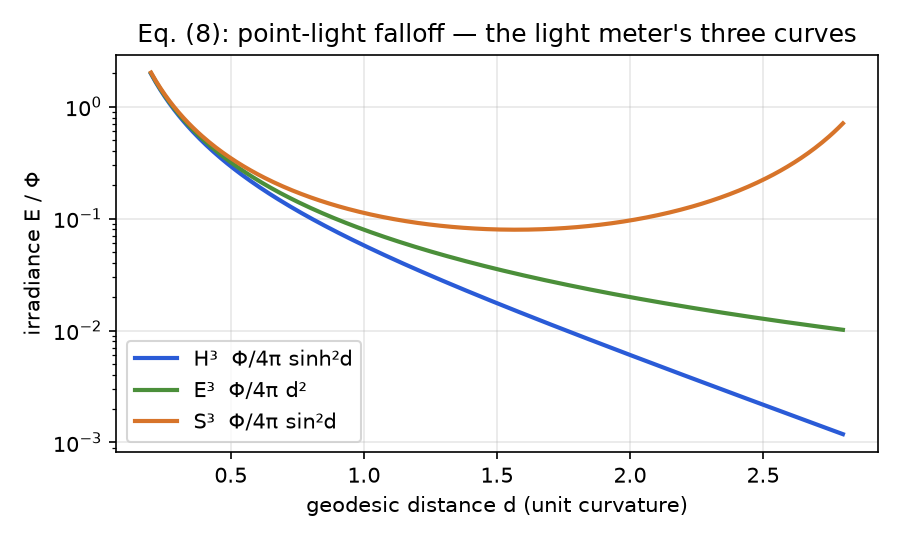
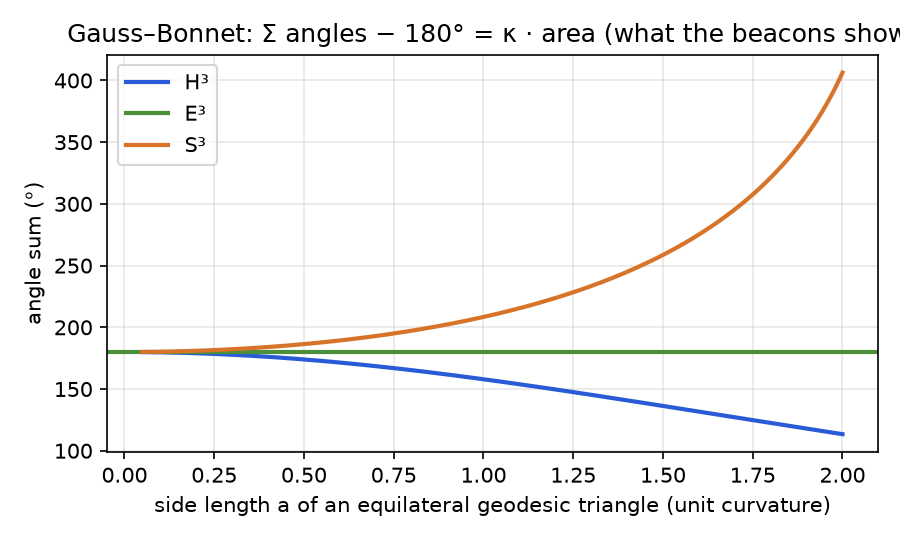
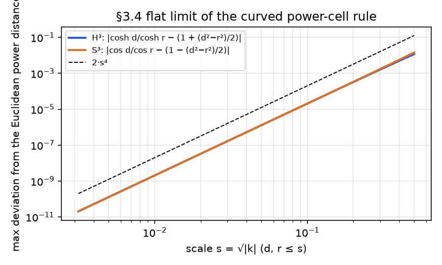
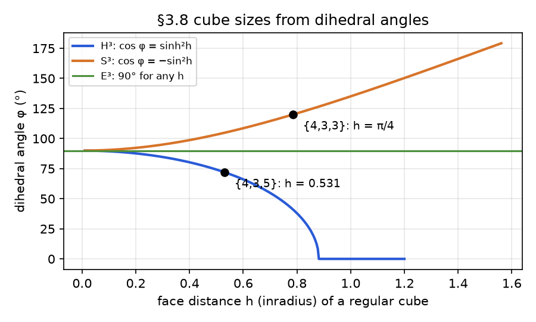
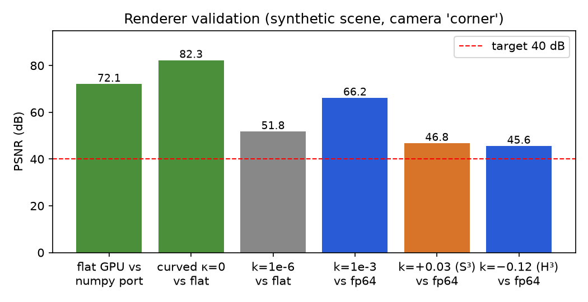

# CRaFT: Curved Radiance Foam Tracing

*Exact geodesic ray tracing of captured scenes in constant-curvature spaces.*
*Huawei Custom Challenge #1, "Beyond Euclid". Mathematical and technical write-up of CRaFT (the method) and Surveyor (the game built on it).*

CRaFT renders a captured Power Foam scene by ray tracing it along exact geodesics of H³, E³ or S³. Surveyor, the game built on it, drops the player into a universe of unknown shape. Everything they see is a real
captured 3D scene (a **Power Foam** reconstruction: an explicit volumetric partition of space
into bounded power cells with oriented, textured dipole surfaces) **ray traced along exact,
closed-form geodesics** of hyperbolic, flat or spherical space. The player works out the
curvature using only light and a few tools: a laser (a visible geodesic), beacons (a geodesic
triangle whose angles they read), a light meter (irradiance against the flat 1/d² law) and a
compass (a parallel-transported vector that returns rotated after a loop). Fundamental domains
with face pairings turn the same scene into a 3-torus, a half-turn space, a non-orientable
space, the {4,3,5} and tesseract honeycombs, the Poincaré dodecahedral space and the
Seifert–Weber space.

Equation numbers below are the ones cited in code comments (`// Eq. (6)`).

---

## 1. Model spaces and the curvature slider

We work in ambient ℝ⁴ with coordinates x = (x₀, x₁, x₂, x₃) and the bilinear form

    ⟨x, y⟩_κ = κ·x₀y₀ + x₁y₁ + x₂y₂ + x₃y₃                                   (1)

- **H³** (κ = −1): the hyperboloid ⟨x,x⟩ = −1, x₀ > 0.
- **S³** (κ = +1): the unit 3-sphere ⟨x,x⟩ = +1.
- **E³** (κ = 0): points (1, x̄), tangents (0, v̄); a separate code path where the form degenerates.

Generalised trigonometry: sn_κ = sin / sinh, cs_κ = cos / cosh, with sn₀(t) = t, cs₀ = 1. The
origin is o = (1,0,0,0) for all κ and the distance satisfies

    cs_κ(d(x,y)) = κ⟨x,y⟩_κ                                                   (2)

which we evaluate through the chord ⟨x−y, x−y⟩_κ = 4 sinh²(d/2) (H³) / 4 sin²(d/2) (S³) — exact,
and accurate when d is tiny where acosh(1+ε) is not.

**One geometry layer serves all three spaces.** `web/src/geometry/space.ts` (TypeScript, fp64)
and `web/shaders/geometry.glsl` (GLSL ES 3.00, fp32) implement the same functions in the same
order with the same equation comments; a probe shader evaluates every GLSL function on 4096
random inputs per κ and the harness compares against TypeScript (max relative error 2·10⁻⁵, no
mismatches).

**Continuous curvature.** The models have unit curvature; a scene of physical size L occupies
size s·L with s = √|k|. As |k| → 0 the scene shrinks into a flat neighbourhood of the origin, so
the picture tends to the flat one from both sides. The E³ path takes over below |k| < 10⁻⁹;
measured against the flat renderer the curved renderer agrees to 43–52 dB at |k| = 10⁻⁶, so the
switch is invisible (§8 on how that was achieved in fp32).

## 2. Geodesic rays and their transported direction

A ray from o′ with unit tangent v (⟨o′,v⟩ = 0, ⟨v,v⟩ = 1), parameterised by arc length t:

    γ(t)  = cs_κ(t)·o′ + sn_κ(t)·v                                            (3)
    γ′(t) = −κ·sn_κ(t)·o′ + cs_κ(t)·v                                         (4)

γ′ is the parallel-transported direction and is what every directional lookup uses (view-dependent
colour, spot-light cones, the compass). The unit tangent at x pointing toward y is

    u = (y − cs_κ(d)·x) / sn_κ(d),   d = d(x,y)                                (5)

Tests: γ stays on the model and γ′ stays a unit tangent (1e-9), Eq. (5) round-trips with Eq. (3),
advancing a ray twice equals advancing it once.

## 3. Closed-form intersections

**Planes.** A linear hyperplane through the origin of ℝ⁴ is {x : w·x = 0} for a covector w (w = Jn
for a κ-normal n, J = diag(κ,1,1,1); for E³ the plane n̄·x̄ = c is w = (−c, n̄)). Along the ray,
with A = w·o′ and B = w·v,

    A·cs_κ(t) + B·sn_κ(t) = 0   ⇒   tn_κ(t) = −A/B                              (6)

E³: t = −A/B. H³: with E = eᵗ, (A+B)E² + (A−B) = 0, so t = ½ ln((B−A)/(A+B)), a root exists iff
|B| > |A|, and it is an exit from the half-space w·x ≤ 0 iff B > 0. S³: f(t) = R cos(t−φ) with
R = √(A²+B²), φ = atan2(B,A); exits at φ − π/2 + 2πk, entries at φ + π/2 + 2πk. The walker always
asks for "the first exit after t_ref" and "the last entry before t_ref", which makes the S³
periodicity explicit.

**Balls.** d(γ(t), p) ≤ r ⇔ A·cs_κ(t) + B·sn_κ(t) ≥ κ·cs_κ(r) with A = ⟨o′,p⟩, B = ⟨v,p⟩:

    S³:  t ∈ [φ − α, φ + α] + 2πk,  α = acos(cos r / R)
    H³:  eᵗ between the roots of (A+B)E² + 2cosh(r)·E + (A−B) = 0                 (7)
    E³:  the usual quadratic

All roots are checked against bisection on the scalar functions (1e-7) for all κ.

## 4. Curved power cells and the linear-bisector argument

Power Foam's cell of site (p_i, r_i) is the set where the **power distance** ‖x−p_i‖² − r_i² is
minimal (paper Eq. 2; `benchmark.py` lifts to (p, ‖p‖² − r²)). We define a_i = p_i / cs_κ(r_i) and

    cell(x) = argmax_i ⟨x, a_i⟩′                                                 (§3.4)

where ⟨·,·⟩′ is ⟨·,·⟩_κ for κ ≠ 0 and the ordinary dot with a_i = (−pm_i, p̄_i), pm = ½(‖p‖²−r²),
for E³. This reproduces H³: min cosh d/cosh r, S³: max cos d/cos r, E³: min ‖x−p‖² − r². The
**flat-limit test** verifies cosh d/cosh r = 1 + (d²−r²)/2 + O(s⁴) and cos d/cos r = 1 − (d²−r²)/2
+ O(s⁴), so both reduce to the Euclidean power distance.

The bisector of i and j is ⟨x, a_j − a_i⟩′ = 0 — a **linear hyperplane** — so cell faces are planar
in the model and Eq. (6) applies unchanged. A point on both spheres lies on the bisector (tested).
Walking a ray is therefore identical to the flat algorithm: find the first bisector plane crossed
(the exit face), clip the segment by the ball (Eq. 7), accumulate.

### Adjacency across the curvature slider

The dual of the curved power diagram is built offline for a sweep of curvatures (12 per sign)
and the **union** of edges is shipped. In the Klein model (y = x̄/x₀) the H³ cell rule
"maximise κa₀ + y·ā" is a Euclidean power diagram of centres c_i = ā_i/2 with weights
w_i = |c_i|² + κa_{i0} (Nielsen–Nock), so `benchmark.py`'s regular-triangulation builder is reused
with transformed sites. In S³ the cells form the normal fan of conv{a_i} ⊂ ℝ⁴, so adjacency =
edges of the 4D convex hull (covering the whole sphere, no chart). A superset is always safe: a
cell is the intersection of all its half-spaces, so the first bisector crossed from inside is a
true face; extra neighbours only cost plane tests. Tests: adjacency vs brute-force ownership at
five curvatures in all three geometries (0 violations on 4000 samples); union-graph walks equal
exact per-k walks at four curvatures **not** in the sweep. The union inflates edges by 15–20 %.

## 5. Embedding a flat-trained scene; exact traversal, locally flat shading

Each flat site x̄ (metres, scaled by s, centred on the player's eye plane) is embedded by the exp
map at the origin, p = cs_κ(|x̄|)·o + sn_κ(|x̄|)·(0, x̂), radii scale by s, and each cell gets the
frame M_p = translation isometry o → p (a boost in H³, a rotation in S³):

    T = [[ c, −κ s ûᵀ ], [ s û, I + (c−1) û ûᵀ ]],  p = (c, s û)                 (§3.7)

Power Foam shades a cell with an oriented dipole (a face through p with normal n splitting the
cell into a dense and an empty half), displaced by a soft-Voronoi field over k detail sites and
coloured by a soft-Voronoi blend of per-site Spherical Voronoi functions (paper Eqs. 3–4). We
keep **traversal exact** (Eqs. 6–7) and do **shading in the cell frame**: the entry point and the
transported direction are mapped by M_p⁻¹, log-mapped to tangent coordinates, and the unmodified
flat dipole / detail-site code runs there. The undisplaced dipole plane through p is a totally
geodesic plane through the frame origin, hence exactly linear in those coordinates; the only
approximation is treating the ray as straight inside the cell. Measured on the scene: max
|Δt|/R = 2.8·10⁻³ (H³, k = −0.12) and 6.8·10⁻⁴ (S³, k = 0.03), i.e. ≈ 2.8·|κ|R² — bounded and
negligible for cells of radius ≲ 10 cm.

Power Foam evaluates the view-dependent colour once per frame per detail site from the camera
direction, not per ray. We mirror that with a pre-pass: for site S the geodesic from the camera
arrives with direction γ′(d) (Eq. 4), which M_p⁻¹ expresses in the cell's flat frame.

## 6. Camera, navigation, holonomy

The camera is always at the origin; the world is carried by a world→camera isometry W with
MᵀJM = J (O(3,1) / O(4); for E³ the condition is a unit top row and an orthonormal rotation
block, since J is degenerate). Movement W ← T(−δ·forward)·W, rotation W ← R·W, and W is
re-orthonormalised every frame by Gram–Schmidt with respect to J. Drift test: 10⁶ random moves
keep ‖WᵀJW − J‖ < 10⁻⁵ (for a *bounded* walk — an unbounded random walk in H³ wanders ~12 units
in 10⁶ steps, where the hyperboloid coordinates reach 10⁵ and fp64 cancellation alone exceeds
10⁻⁵; the game keeps W bounded by re-centring on domain crossings). The player's body stays on the
totally geodesic "eye plane" x₂ = 0: every move is a transvection along it or a rotation about
its normal.

**Compass = holonomy.** In camera coordinates a translation moves the frame and any transported
vector identically, so the compass components change only under yaw. After a closed geodesic
polygon the walker has turned by Σ(exterior angles) = 2π − κ·A (Gauss–Bonnet), so the compass is
off from the heading by exactly κ·A. Tested for a geodesic triangle in all three geometries.

**Beacons.** Angles from Eq. (5) tangents; the numerically integrated area (polar coordinates about
a vertex, area element sn_κ(r) dr dθ) times κ equals the angle excess (tested, 2·10⁻³). The HUD
shows angles and sides but never the area.

## 7. Topology: fundamental domains and face pairings

A space is a convex polyhedron D = {x : w_f·x ≤ 0} plus, per face, an isometry g_f mapping f
onto its partner with g_partner = g_f⁻¹. When a ray exits through f its state (point, direction)
is transformed by g_f, re-projected onto the model, and continues; the camera re-centres with
W ← W·g_f⁻¹ when the eye crosses. Orientation-reversing pairings transform the ray, never the
scene, so a Klein-space loop returns the player mirrored. Point location after a crossing uses a
32×32 chart per face (exp-map coordinates at the face centre) that stores a cell-id guess,
followed by steepest ascent on ⟨x,a_i⟩′ (≤ 3 steps measured); tested equal to brute force.

Cube sizes from dihedral angles φ: cos φ = sinh²h (H³) and cos φ = −sin²h (S³), giving h = 0.5306
for {4,3,5} (72°) and h = π/4 for the tesseract (120°); dodecahedra: cos φ = sinh²h − cosh²h cos θ
(H³) and −sin²h − cos²h cos θ (S³) with θ = atan 2 between adjacent face directions, giving
h = π/10 for the Poincaré dodecahedral space (the 120-cell's cell) and h = 0.996 for Seifert–Weber.
Tests measure the dihedral angles numerically at edges (90.000/72.000/120.000°), check every
pairing maps sampled face points onto the partner plane, and verify that **edge cycles compose to
the identity** (3 pairings around each edge for PDS with its 36° twist, 5 for Seifert–Weber with
108°) while the wrong twists fail.

## 8. Numerical findings worth stating

1. **Flat-limit precision in fp32.** Bisector offsets and the ball test are O(s²) quantities
   obtained from O(1) numbers; at s = 10⁻³ the curved render was garbage (5 dB). We store a₀ − 1
   instead of a₀ and rewrite Eq. (7) with A′ = A − κ = −½⟨o′−p, o′−p⟩_κ (the chord), so the small
   terms are computed from small differences. Same equations, different order of operations; GPU
   fp32 then matches an fp64 CPU reference at 45–66 dB across k, and the E³ switch is invisible.
2. **Degenerate J for E³.** "MᵀJM = J" characterises isometries only for κ ≠ 0.
3. **Empty space matters more than the scene.** Power Foam's Steiner rule (Normal(mean, ½σ)) leaves
   the air above an open scene to a few cells of degree 500; sampling Steiner candidates uniformly
   in the padded domain cut the worst degree in half and made tiled frames 3–7× faster.

## 9. Lighting and audio in curved space

A point light of power Φ at distance d gives irradiance

    E = (Φ / 4π) · max(0, ⟨u, n⟩) / sn_κ(d)²                                     (8)

because a geodesic sphere of radius R has area 4π sn_κ(R)²; the flux test integrates Eq. (8)
over spheres of four radii per κ and recovers Φ to 10⁻⁹. In S³ light also arrives the long way
round (distance 2π − d, direction −u) and refocuses at the antipode — level 3 is built on it.
Shadow rays walk geodesics through the same foam toward each lamp (half resolution). The
flashlight is a spotlight at the camera whose shadow is the primary ray's own transmittance.
Fog e^{−σt} doubles as the walk's distance cutoff and also attenuates light paths. Audio uses the
same spreading law: gain ∝ 1/sn_κ(d)², panned by the Eq. (5) arrival direction.

Documented approximation: lighting is evaluated once per pixel at the median-depth hit and
multiplies the accumulated baked colour.

## 10. Theoretical bonus: exact rasterisation of a single curved scene

With the camera at the origin, geodesics through the camera are straight radial lines in the
Klein model, and the curved power diagram is a Euclidean power diagram there (§4). Power Foam's
painter's-ordering proof (paper App. B: sorting cells by power distance from the camera is a
valid painter's order because every bisector is a hyperplane and a segment from the camera can
cross it only once) therefore carries over verbatim: an untiled curved scene could be rasterised
exactly by sorting in Klein coordinates, with segment lengths measured by atanh(ρ) (H³) or
atan(ρ) (S³, one hemisphere per pass). We ray trace because tiling and shadow rays need it.

## 11. Architecture

```
tools/            Python (run once): checkpoint → Steiner points → regular triangulation per κ →
                  union adjacency → scene.bin; numpy reference renderers (flat = line-by-line port
                  of the Warp kernel; curved = fp64 mirror of the shader)
web/src/geometry  space.ts  — Eqs. 1–8, isometries (mirrored by shaders/geometry.glsl)
web/src/foam      scene loader, per-κ site recompute (a_i, R_i)
web/src/topology  domains (box, cube honeycombs, dodecahedra), point-location charts
web/src/render    passes: SV pre-pass → walk (G-buffer MRT) → shadow → shade; lights
web/src/game      isometry camera, player (collision, compass), tools, levels
web/src/ui        overlay (compass, map inset, laser, markers), HUD, gallery
web/shaders       walk_curved.frag, sv_prepass_curved.frag, shadow.frag, shade.frag, probe
tests/            63+ TypeScript tests (geometry, domains, locate, compass, tools), 25 Python tests
```

## 12. Figures (generated by `tools/make_figures.py`)

| | |
|---|---|
|  Eq. (8) falloff: the light meter's three curves |  Gauss–Bonnet: angle sum vs triangle size |
|  flat limit of the curved power-cell rule, O(s⁴) |  cube dihedral angle vs inradius; {4,3,5} and {4,3,3} marked |
|  renderer validation PSNRs | |

## 13. Validation summary

| check | result |
|---|---|
| flat GPU walk vs numpy port of the Power Foam kernel (4 cameras) | 72–74 dB |
| curved walker at κ = 0 vs flat walker | 81–95 dB |
| curved GPU fp32 vs fp64 CPU reference, k = −0.12 / +0.03 / 0.001 | 45.6 / 46.8 / 66.2 dB |
| E³ switch continuity, k = ±10⁻⁶ vs flat | 52 / 43 dB |
| GLSL vs TS geometry, 27 function×κ combos, 4096 cases each | 0 mismatches, rel 2·10⁻⁵ |
| closed-form roots vs bisection (Eqs. 6, 7) | 1e-7 |
| flat limit of the curved power distance | O(s⁴) |
| adjacency vs brute force; union walk == exact walk off-sweep | 0 / 0 mismatches |
| local-flat shading error | ≤ 2.8·κR² |
| dihedral angles; pairings; edge cycles | exact to 1e-6° / 1e-9 / identity |
| compass holonomy == κ·Area; Gauss–Bonnet numeric area | 2e-3 |
| flux through geodesic spheres | 1e-9 |

## 14. Performance (Apple M1 Pro, Chrome)

| configuration | 1920×1080 | 1280×720 |
|---|---|---|
| flat walk, 24.5k cells, typical view | 20–24 ms | 10–12 ms |
| curved walk κ = 0 / H³ / S³ (per-κ compiled) | 61 / 54 / 97 ms (worst view) | 30 / 26 / 47 ms |
| tiled spaces, open scene, fog 30 m | — | 44 (3-torus), 45 ({4,3,5}), 62 (tesseract), 65 (PDS) ms |
| full lit pipeline (walk + ½-res shadows + shading), 2 lamps | — | 21.5 (E³) / 26.2 (H³) ms |

Auto quality targets 30 fps by scaling the render resolution (0.4–1.0); presets Low/Medium/High.
A discrete GPU is several times faster than this integrated one.

## 15. Limitations

- **Constant curvature only.** Killing–Hopf: the complete, simply connected, constant-curvature
  spaces are exactly H³, E³, S³, and every closed-form formula above relies on that. Variable
  curvature would need numerical geodesic integration and lose exact traversal.
- The captured scene is reconstructed in flat space; its embedding is exact at each site and a
  bounded small-cell approximation elsewhere (§5).
- Lighting is deferred to the median-depth hit; the laser is drawn as an overlay (not occluded).
- Lamps light the home-domain image only (not their copies through the walls).
- Development used a synthetic scene in the exact Power Foam checkpoint format; the PSNR test
  against the repo's own Warp kernel on a trained scene is pending a CUDA machine.

## 16. Prior art and how we differ

Jeff Weeks' *Curved Spaces* (closed 3-manifolds, polygon rendering), *Hyperbolica* (hyperbolic/
spherical game, mesh rendering with per-vertex projection), *Hyperbolic VR* (Hart, Hawksley,
Matsumoto, Segerman; ray marching) and Thurston-style ray marchers (e.g. Nelson–Segerman–Woodard)
render synthetic geometry. Surveyor renders a **captured photographic scene** (a differentiable
foam reconstruction) with **exact per-cell geodesic intersections** rather than marching, treats
the curvature as a **continuous slider** with one κ-parameterised geometry layer, and makes the
geometry **measurable** by the player with physically correct light falloff and holonomy.
